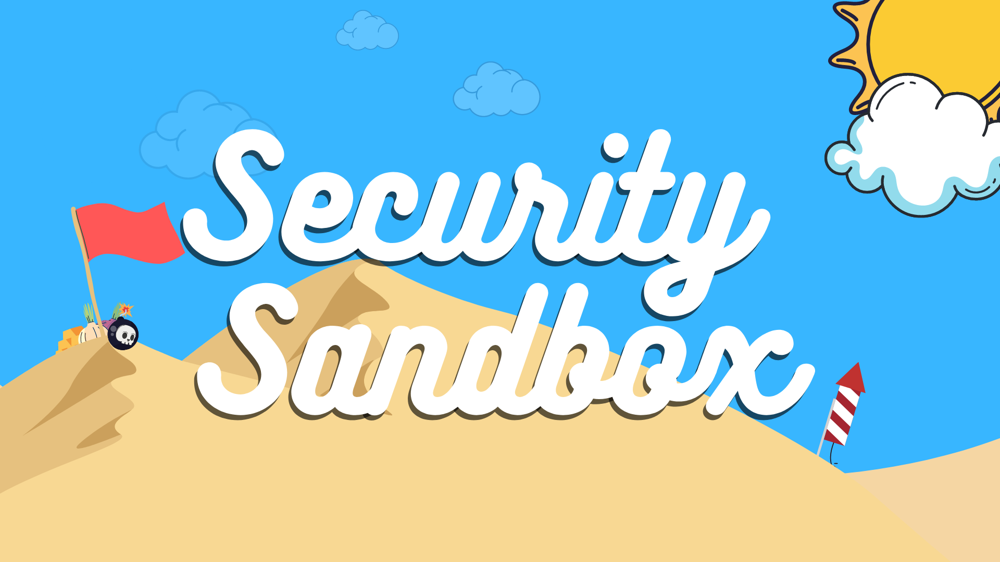

# Security Sandbox 🏖️

> My personal sandbox environment for testing out new
> security tools, vulnerable applications, and using in CTFs.
> Feel free to use this for your own studying or enjoyment!



## Requirements 🎬

There are only two requirements to
get up and running:

- [Virtual Box](https://www.virtualbox.org/) or [VMWare Workstation](https://www.vmware.com/products/workstation-player/workstation-player-evaluation.html)
- [Hashicorp Vagrant](https://www.vagrantup.com/downloads)

Once you've got a virtualization solution setup as well as Hashicorp Vagrant, you're ready to go.

## Usage ⚡

Set up the Vagrant box and bootstrap it with
my preferred directory structure and workspace environment.

```shell
# Clone the repository with the Github CLI
gh repo clone zferg/security-sandbox

# Start up the primary Kali machine
vagrant up

# The login is
username: vagrant
password: vagrant
```

## Help 🆘

To view the available helper commands use `make help`.

```shell
❯ make help
Usage:
kali            Build the Kali box
sandbox         Build the whole sandbox
teardown        Tear down the sandbox
destroy         Destroy the sandbox
```

## Red Team Lab Environment (Optional) 🟥

This virtual environment comes with a few testing labs available. 
Pick your flavor!

### Red Team Tools 🔧

These are tools that will help you exploit the vulnerable distributions and applications found below.

#### Kali

The kali box comes with tor and proxychains setup on boot, so feel free to chain requests through there first.

```shell
# Check tor service
systemctl status tor

# Run a port scan against scanme.nmap.org
# through a tor proxy 
proxychains nmap -sT -Pn scanme.nmap.org 
```

### Catered to Learning

These are generally catered to learning skills or specific tools/frameworks.

#### Metasploitable 2

A vulnerable VM made to teach, and give you a target for, the Metasploit framework.

```shell
# Start up Metasploitable
vagrant up metasploitable

# Navigate to http://192.168.33.40
```
#### Juiceshop

OWASP made well-rounded vulnerable web application that has tutorials and challenges that will help you learn, and exploit, web vulnerabilities.

```shell
# Start up juiceshop
vagrant up juiceshop

# Navigate to http://192.168.33.20
```
#### NETinVM

Creates a whole network of virtual machines inside of a singular virtual machine image, very helpful to learn about networks and network security. 

```shell
# Start up NETinVM
vagrant up netinvm
```

#### WebGoat

OWASP open source project that explains a vulnerability and then allows you to test it in the web application.

```shell
# Start up WebGoat
vagrant up webgoat
```

### Catered to Testing Skills

These are more catered toward using and testing your tools and skills.
#### Damn Vulnerable Web Application

PHP/MySQL web application that gives you a place to test what you have learned.

```shell
# Start up DVWA
vagrant up dvwa

# Navigate to http://192.168.33.30
```
#### Mutillidae 2

An easy to use open source vulnerable web application that has been kept up to date by webpwnized for years, has been used in everything from corporate web security training to gradute security classes.

```shell
# Start up Mutillidae
vagrant up mutillidae
```
#### SamuraiWTF

While it is not itself a vulnerable application, it contains vulnerable web applications that can be used to test yourself against.

```shell
# Start up SamuraiWTF
vagrant up samuraiWTF
```

## Blue Team Environment (Optional) 🟦

If you're looking for a good blue team environment to pair with this sandbox, I recommend a [Detection Lab](https://detectionlab.network/) deployment. 

Setup instructions can be found here:
[Detection Lab Deployment Instructions](https://detectionlab.network/deployment/)


## Collaborate Online

If you'd like to collaborate with others on any of the vulnerable web applications, you can use [vagrant share](https://www.vagrantup.com/docs/share)
right in the command line. This will create a URL that you can give to anyone and will route directly into your chosen Vagrant environment.

This utilizes a service called [ngrok](https://ngrok.com). For more information, visit ngrok's documentation.

```shell
# Install the plugin
vagrant plugin install vagrant-share

# Share your environment
vagrant share
```

---

## References

[OWASP Juiceshop](https://owasp.org/www-project-juice-shop/)

[OWASP Juiceshop CTF](https://github.com/bkimminich/juice-shop-ctf)

[DVWA](https://dvwa.co.uk/)

[Metasploitable](https://github.com/rapid7/metasploitable3)

[Metasploitable vulnerabilities](https://github.com/rapid7/metasploitable3/wiki/Vulnerabilities)
